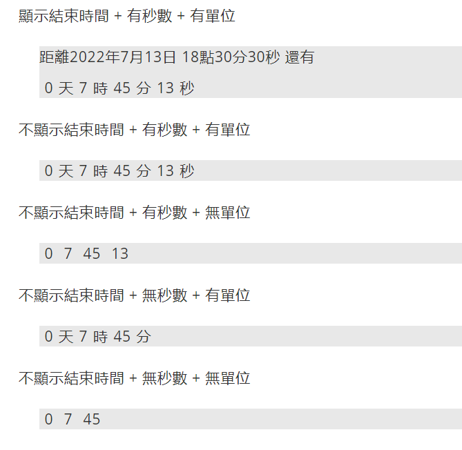

# Timer on magento2

## parameters
`selector {String}`

Select the container to put timer in.

`endTime {Object}`

The timer will count down to this endTime.
`hour`, `min`, `sec` is optional.
```
{
    year:2022,
    month:7,
    date:5
    [,hour:18,
    min:0,
    sec:0]
}
```
Default : 0

`showEndTime {Boolean}`

Allow end time show up.

Default : false

`showSec {Boolean}`

Allow second show up.

Default : false

`showText {Boolean}`

Allow text (like: 天、十、分、秒) show up.

Default : false

`extendEndTime {Object}`

If there any extend end time to count down after end time.
```
{
    year:2022,
    month:7,
    date:5,
    hour:18,
    min:0,
    sec:0
}
```

## example

1. include block in the page


2. call function
```HTML
<div class="peixuan-timer timer-container"></div>
```
```javascript
let input = {year:2022,month:7,date:13,hour:18,min:30,sec:30};

startTimer({
    selector:'.peixuan-timer',
    finalTime: input,
    showEndTime: true,
    showSec:true,
    showText:true
});
```

